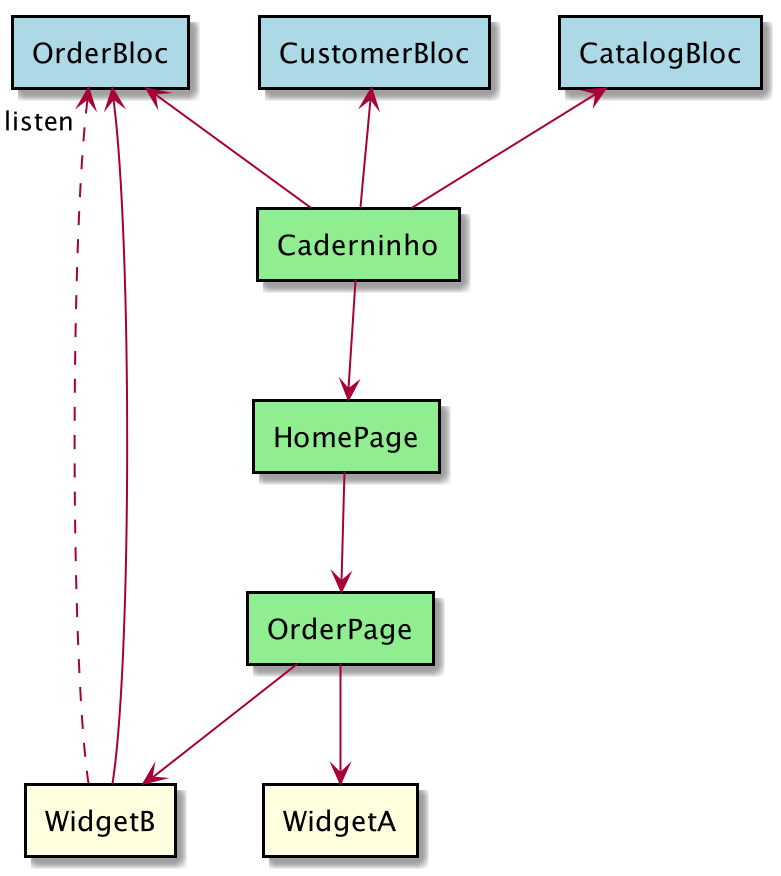
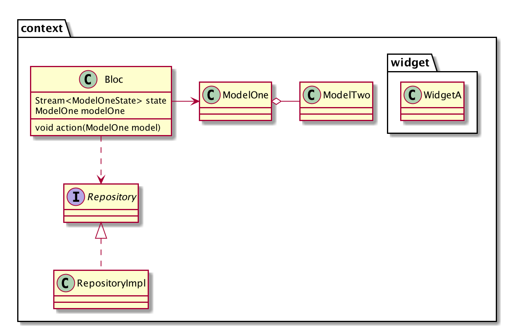

# Caderninho

A Flutter app for managing products, customers and orders.
  
## Features

- Add customers
  - Import contacts as customer
  - See customer orders

- Add products (model, brand, price, picture)

- Create orders
  - Share order as text (products with price and quantity, order number, date, total price, etc.) 

## Running

The project was made with Flutter + Dart, and can run on iOS and Android. To run the project just execute command below on terminal with a connected device or run directly from an IDE.
> flutter run

## Architecture

The package structure is focused on "bounded contexts" so each context has a package with all its data, such as models, Widgets, repository and BLoC.
The three mains packages are **catalog**, **customer** and **order**.
The **page** package is where the pages of the app resides, each page is responsible to use and combine context specific Widgets.

Due to the reactive nature of Flutter applications, the BLoC pattern is used. Each domain context has a dedicated BLoC which provides methods to operate on the domain models, 
and is responsible to manage and notify it listeners of the state of the model. 
Notification are emitted using `ChangeNotifier`s and `Stream`s     

The overall app architecture is as follows

The overall architecture of each "bounded context" package is as follows

## Tests
Tests (and coding) were made using the Behavior-driven Development approach to ensure the use cases were working as expected. Tests were made to cover the 3 layers, so covering Widgets behavior, data consuming and management and data fetching.
